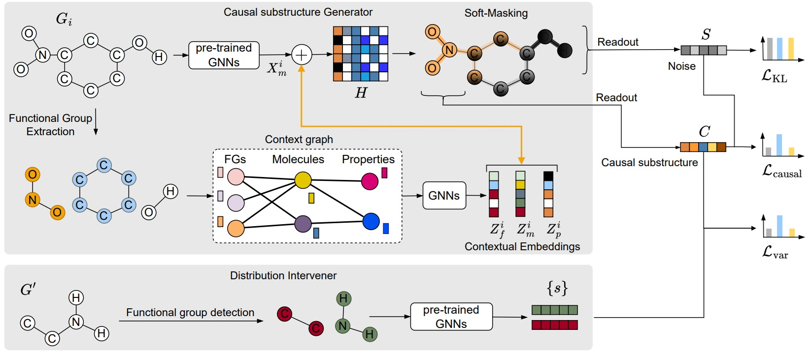

# Molecular Graph Causality Inference Framework <br> (CaMol)
CaMol is a novel architecture for predicting molecular property in few-shot scenarios and developed by [NS Lab, CUK](https://nslab-cuk.github.io/) based on pure [PyTorch](https://github.com/pytorch/pytorch) backend. 

<p align=center>
  <a href="https://www.python.org/downloads/release/python-360/">
    =3.8.8-3776AB?logo=python&style=flat-square" alt="Python">
  </a>    
  <a href="https://github.com/pytorch/pytorch">
    =1.4-FF6F00?logo=pytorch&style=flat-square" alt="pytorch">
  </a>    
  
  
  
  
  
  
  
</p>

<br>


## 1. Overview

We aim to build a context-aware graph causality inference framework to address the few-shot molecular property prediction tasks. Molecular property prediction is becoming one of the major applications of graph learning in Web-based services, e.g., online protein structure prediction and drug discovery. A key challenge arises in few-shot scenarios, where only a few labeled molecules are available for predicting unseen properties. Recently, several studies have used in-context learning to capture relationships among molecules and properties, but they face two limitations in: (1) exploiting prior knowledge of functional groups that are causally linked to properties and (2) identifying key substructures directly correlated with properties. We propose CaMol, a context-aware graph causality inference framework, to address these challenges by using a causal inference perspective, assuming that each molecule consists of a latent causal structure that determines a specific property. First, we introduce a context graph that encodes chemical knowledge by linking functional groups, molecules, and properties to guide the discovery of causal substructures. Second, we propose a learnable atom soft-masking strategy to disentangle causal substructures from confounding ones. Third, we introduce a distribution intervener that applies backdoor adjustment by combining causal substructures with chemically grounded confounders, disentangling causal effects from real-world chemical variations. Experiments on diverse molecular datasets showed that CaMol achieved superior accuracy and sample efficiency in few-shot tasks, showing its generalizability to unseen properties. Also, the discovered causal substructures were strongly aligned with chemical knowledge about functional groups, supporting the model interpretability.

<br>

<p align="center">
  
  <br>
  <b></b> The overall architecture of CaMol.
</p>


## 2. Reproducibility

### Datasets 

We conducted experiments across on six widely used few-shot molecular property prediction datasets from MoleculeNet: Tox21, SIDER, MUV, ToxCast, PCBA, and ClinTox.
For the pre-trained encoder, we adopt S-CGIB as the backbone encoder.

### Requirements and Environment Setup

The source code was developed in Python 3.8.8. CaMol is built using Torch-geometric 2.3.1 and DGL 1.1.0. Please refer to the official websites for installation and setup.
All the requirements are included in the ```environment.yml``` file.

```
# Conda installation

# Install python environment

conda env create -f environment.yml 
```

#### How to run the CaMol on few-shot molecular property prediction
```
# Use the following command to run the few-shot tasks, the model performance will be sent to the command console.
python exp_moleculeSTCT_p.py --dataset Tox21 --num_eposides 3000 --num_query 10 --k_shot 5 --device cuda:0

```

### Hyperparameters

The following options can be passed to the below commands for fine-tuning the model:

```--device:``` The GPU id. For example: ```--device 0```.

```--dataset:``` The downstream dataset. For example: ```--dataset Tox21```

```--k_shot:``` The number of support samples. For example: ```--k_shot 5```

```--num_eposides:``` The number of eposides for training. For example: ```--num_eposides 3000```

```--num_query:``` The number of query samples. For example: ```--num_query 10```

```--hidden_dim:``` The dimension of hidden vectors. For example: ```--hidden_dim 64```

```--lr_inner:``` The learning rate of inner optimization. For example: ```--lr_inner 0.05```

```--lr_outer:``` The learning rate of meta optimization. For example: ```--lr_outer 0.001```

```--norm:``` The use of batch normalization. For example: ```--norm 1```


## 3. Reference

:page_with_curl: Paper [on arXiv](https://arxiv.org/): 
* [](https://arxiv.org/abs/2601.11135) 


## 4. Citing CaMol

Please cite our [paper](https://arxiv.org/abs/2601.11135) if you find *CaMol* useful in your work:
```
@misc{hoang2026contextawaregraphcausalityinference,
      title={Context-aware Graph Causality Inference for Few-Shot Molecular Property Prediction}, 
      author={Van Thuy Hoang and O-Joun Lee},
      year={2026},
      eprint={2601.11135},
      archivePrefix={arXiv},
      primaryClass={cs.LG},
      url={https://arxiv.org/abs/2601.11135}, 
}
```

Please take a look at our unified graph transformer model, [**UGT**](https://github.com/NSLab-CUK/Unified-Graph-Transformer), which can preserve local and globl graph structure, community-aware graph transformer model, [**CGT**](https://github.com/NSLab-CUK/Community-aware-Graph-Transformer), which can mitigate degree bias problem of message passing mechanism, [**S-CGIB**](https://github.com/NSLab-CUK/S-CGIB), which builds a pre-trained Graph Neural Network (GNN) model on molecules without human annotations or prior knowledge, and [**MVCIB**](https://github.com/NSLab-CUK/MVCIB), which builds a pre-trained GNN model on 2D and 3D molecular structures, together. 


## 5. Contributors

<a href="https://github.com/NSLab-CUK/MVCIB/graphs/contributors">
  
</a>


<br>

***

<a href="https://nslab-cuk.github.io/"></a>

***
